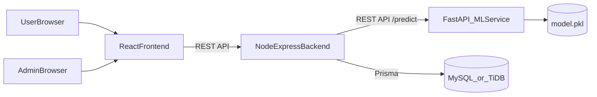

# Fake News Detector Fullstack + ML Plan

## Scope and Chosen Defaults

- Monorepo normalized to:
  - `fake-news-detector/frontend`
  - `fake-news-detector/backend`
  - `fake-news-detector/ml-service`
  - `fake-news-detector/database`
- Existing React scaffold will be migrated into `frontend`.
- ML service framework: **FastAPI**.
- Database stack: **MySQL/TiDB + Prisma ORM** with schema + migrations.

## Target Architecture

## Reordered Execution Plan (From Current Baseline)

Since the minimum deployed stack is already working (frontend + backend + ML + DB connectivity), continue in this order:

1. **Phase 4 first**: Setup Database Schema + Migrations (real `news` and `predictions` tables).
2. **Phase 3 next**: Expand Backend API with full CRUD + prediction persistence.
3. **Phase 6 after backend expansion**: Harden backend-ML integration (timeouts, retries, stable contracts).
4. **Phase 7 next**: Build complete frontend pages (User page + Admin dashboard).
5. **Phase 5 after UI/API are ready**: Replace dummy ML with TF-IDF + Logistic Regression model.
6. **Phase 8**: Run full local end-to-end testing with local/remote ML toggle scenarios.
7. **Phase 9**: Finalize production env/config review.
8. **Phase 10**: Redeploy updated services and run production smoke tests.

### Status Checkpoint

- **Completed already**: Phase 1, Phase 2, and minimum baseline parts of Phase 3/5/7/10.
- **In progress now**: move from baseline to full feature implementation with DB-first approach.

## Phase 1: Plan Architecture

- Confirm 3 independent services:
  - Frontend (React + Tailwind, Vercel)
  - Backend (Node.js + Express, Render)
  - ML Service (Python FastAPI, Render)
- Keep strict decoupling:
  - Frontend talks only to Backend
  - Backend talks only to ML API via `ML_SERVICE_URL`
  - No ML code inside backend
- Define stable ML contract:
  - `POST /predict` request: `{ text: string }`
  - `POST /predict` response: `{ prediction: "Fake" | "True", confidence: number }`

## Phase 2: Setup Folder Structure

- Create/normalize:
  - `frontend/`
  - `backend/`
  - `ml-service/`
  - `database/`
- Move existing React Vite project into `frontend/`.
- Create root files:
  - `README.md`
  - `.envDevelopment.example`
  - `.envProduction.example`
  - `.gitignore`

## Phase 3: Build Backend API (Node.js + Express)

- Backend base structure:
  - `backend/src/server.js`
  - `backend/src/app.js`
  - `backend/src/config/env.js`
  - `backend/src/lib/prisma.js`
  - `backend/src/lib/mlClient.js`
  - `backend/src/controllers/*`
  - `backend/src/routes/*`
- Implement endpoints:
  - `POST /api/auth/login` (optional simple admin auth)
  - `GET /api/news`
  - `POST /api/news`
  - `PUT /api/news/:id`
  - `DELETE /api/news/:id`
  - `POST /api/predict`
  - `GET /api/predictions`
  - `GET /api/metrics/accuracy` (optional extra)
- `POST /api/predict` flow:
  - validate input text
  - call `${ML_SERVICE_URL}/predict`
  - save result in `predictions` table
  - return prediction + confidence

## Phase 4: Setup Database (Schema + Migrations)

- Use Prisma in `database/prisma/schema.prisma`.
- Define models:
  - `News`:
    - `id`
    - `title`
    - `content`
    - `label` (`fake`/`true`)
    - `created_at`
  - `Prediction`:
    - `id`
    - `input_text`
    - `prediction`
    - `confidence`
    - `created_at`
- Add migration pipeline:
  - change `schema.prisma`
  - generate migration in `database/prisma/migrations`
  - apply in dev/prod

## Phase 5: Build ML Service (FastAPI)

- Service files:
  - `ml-service/app/main.py`
  - `ml-service/app/schemas.py`
  - `ml-service/app/model_service.py`
  - `ml-service/model.pkl`
- Implement ML pipeline:
  - TF-IDF Vectorizer + Logistic Regression (scikit-learn)
  - train on seed dataset / uploaded news
  - save as `model.pkl`
- Implement endpoints:
  - `POST /predict`
  - optional `POST /train`
  - `GET /health`

## Phase 6: Connect Backend to ML Service

- Build reusable ML HTTP client in backend.
- Read ML base URL only from env (`ML_SERVICE_URL`).
- Handle ML errors and timeouts gracefully.
- Keep backend agnostic to algorithm/model internals.

## Phase 7: Build Frontend (React + Tailwind)

- Main pages:
  - User Prediction Page
  - Admin Dashboard
- User page features:
  - textarea for news content
  - predict button
  - show prediction + confidence
- Admin page features:
  - form to add news (`title`, `content`, `label`)
  - list/view dataset entries
- Frontend structure:
  - `frontend/src/pages/*`
  - `frontend/src/components/*`
  - `frontend/src/services/api.js`
- API layer talks only to backend URL from `VITE_BACKEND_URL`.

## Phase 8: Test Locally (MAMP MySQL)

- Start all services independently:
  - frontend: `npm run dev`
  - backend: `npm run dev`
  - ml-service: `uvicorn app.main:app --reload`
- Verify:
  - admin can create/read news
  - user prediction works end-to-end via backend
  - predictions are stored in DB
  - CORS and env wiring are correct

## Phase 9: Prepare Production Config (.envProduction)

- Maintain two environment files:
  - `.envDevelopment`
  - `.envProduction`
- Backend env auto-loader:
  - `NODE_ENV=production` -> load `.envProduction`
  - otherwise -> load `.envDevelopment`
- Required variables:
  - `DATABASE_URL` (MAMP dev / TiDB prod)
  - `ML_SERVICE_URL`
  - `PORT`
  - `VITE_BACKEND_URL` (frontend)

## Phase 10: Deploy Services

- Frontend -> Vercel (root: `frontend`)
- Backend -> Render (root: `backend`)
- ML Service -> Render (root: `ml-service`)
- Database -> TiDB (production)
- Run Prisma migrations on TiDB before backend go live.

## Optional Extra Features

- Prediction history page/table.
- Accuracy metric endpoint + dashboard card.
- Improved admin auth/session flow.

## Final Deliverables

- Fully working monorepo.
- Clear setup + run + migration + deployment docs in `README.md`.
- End-to-end API connections working.
- Replaceable ML service architecture (contract-stable, backend-agnostic).
